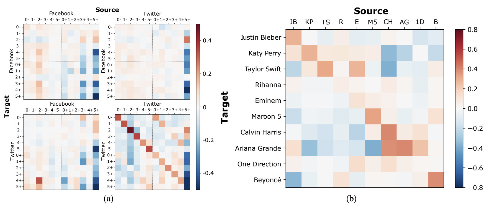

## Introduction 

In our digital age, the surge of online extremism brings forth urgent concerns such as hate speech normalization, user radicalization, and societal division. Counteracting these issues calls for exploring mitigation strategies, be it through negative interventions, an example of which is the EU’s Digital Services Act seeking to regulate deletion of harmful content, or positive interventions strategically introduced into the opinion landscape to boost certain opinions. In our latest work (to be presented at ICWSM 2024), we introduce the Opinion Market Model (OMM) as a testbed to simulate and measure the impact of positive interventions on online opinion dynamics. Additionally, we show the OMM’s capability to detect possible backfiring of debunking.

In this blog post, we delve into OMM's structure and demonstrate its ability to uncover cooperation-competition relations across online opinions about (a) Australian bushfires and (b) popular VEVO artists, and show how media coverage modulates the spread of far-right opinion.

**Paper citation:**
```
Calderon, Pio, Rohit Ram, and Marian-Andrei Rizoiu. "Opinion Market Model: 
Stemming Far-Right Opinion Spread using Positive Interventions." In 
International AAAI Conference on Web and Social Media (ICWSM) 2024.
```
(_see full paper here: [https://arxiv.org/pdf/2208.06620.pdf](https://arxiv.org/pdf/2208.06620.pdf)_)

## Interventions in the Online Opinion Ecosystem

Online social media platforms are breeding grounds for discourse, fostering both cooperation and competition among opinions vying for limited public attention [1]. Two distinct intervention strategies have emerged to counter extremist views in the online landscape. Negative interventions operate by diverting attention away from certain opinions, employing measures such as fact-check alerts [2], shadow-banning [3], and outright banning of extremist content [4]. While these methods have proven effective [5], they are predominantly within the control of social media platforms that use them sparingly [6]. Conversely, positive interventions [7], including debunking misinformation [8] and amplifying media coverage [9], combat extremism by boosting certain opinions, often under the purview of governmental and media entities [10].

Evaluating the feasibility and effectiveness of positive interventions requires the ability (1) to disentangle inter-opinion interactions from the reaction of opinions to interventions and (2) to test the sensitivity of the opinion ecosystem to interventions. We propose the Opinion Market Model handle these two issues effectively.


## Our Solution: The Opinion Market Model

The Opinion Market Model (OMM) models online opinion dynamics resulting from inter-opinion interactions and positive interventions' influence. Drawing an analogy from economic markets, the model views opinions as analogous to economic goods. Just as goods can compete or reinforce each other's market share, online opinions can engage in similar dynamics—competing for limited online attention or complementing each other. This analogy allows for applying market share attraction models [11], aiding in understanding opinion interactions and their competition for users' attention in the online realm.


<p style="text-align: center;"><em>Figure 1. The OMM as a two-tier model of the online opinion ecosystem.</em></p>

OMM models the online opinion ecosystem across two tiers: online attention volumes and opinion market shares. Illustrated in Figure 1 is a simplified scenario with two opinions (labeled 0 and 1) on a social media platform. Each opinion is assumed to have two stances denoting far-right support (+) and moderate views (-).

In terms of system inputs (top row of Figure 1), the OMM makes a distinction between exogenous signals \\(S(t)\\) (gray) and interventions \\(X(t)\\) (yellow) to influence online opinions. Exogenous signals modulate the dynamics of the opinions’ sizes and represent events like natural disasters or speeches. Interventions (such as increased media coverage) are designed to add attention to the opinion ecosystem, increasing the market share of certain opinions while suppressing others.

The first tier (middle row of Figure 1) uses a discrete-time Hawkes process [12] to estimate opinion attention volumes (i.e. the daily number of postings featuring opinions) driven by both exogenous signals and the self-exciting nature of online popularity.
The second tier (bottom row of Figure 1) uses a market share attraction model to capture both inter-opinion interactions, either cooperative or competitive and driven by limited online user attention, and their response to positive interventions.

### Datasets

We utilize two real-world datasets to showcase the predictive and interpretative capabilities of the OMM. Below, we give a short description of each.

**Bushfire Opinions dataset.** The Bushfire Opinions dataset contains 90 days of Twitter and Facebook discussions about bushfires and climate change between 1 November 2019 to 29 January 2020. We filter and label relevant Facebook and Twitter postings using the textual topic and opinion classifiers developed in [13] into six opinions:

0. Greens policies are the cause of the Australian bushfires.
1. Mainstream media cannot be trusted.
2. Climate change crisis is not real / is a UN hoax.
3. Australian bushfires and climate change are not related.
4. Australian bushfires were caused by random arsonists.
5. Bushfires are a normal summer occurrence in Australia.

To distinguish between moderate (-) and far-right (+) opinions, we utilize the far-right stance detector in [14], which employs a measure of textual homophily to gauge the similarity between Twitter users and established far-right figures. Our set of opinions is denoted as \\(\{\(i−, i+\)|i ∈ {0, ... , 5}}\\). In total, we analyze data from two platforms, encompassing 74,461 tweets and 7,974 Facebook posts, all labeled with 12 distinct stanced opinions.

The exogenous signal \\(S(t)\\) is defined as the 5-day rolling average of the Google Trends query "bushfire+climate change" in Australia, functioning as a representation of general interest and offline occurrences [15]. For positive interventions \\({X_k(t)}\\), we incorporate reputable (R) and controversial (C) news coverage from Australian and international sources. Reputable sources are drawn from the Reputable News Index (RNIX) [16], while controversial international sources are accessed through NELA-GT-2019 [17].

**VEVO 2017 Top 10 dataset.** We evaluate the OMM on a second dataset obtained by aligning artist-level time series of YouTube views and Twitter post counts for the top 10 VEVO-affiliated artists over a span of 100 days from 2 January 2017, to 11 April 2017. The YouTube data from the VEVO Music Graph dataset [18] encompasses daily view counts for music videos by verified VEVO artists across six English-speaking countries. Twitter post counts are collected through the Twitter API, using the artist's name as the input query. Unlike the Bushfire Opinions dataset, here we utilize distinct exogenous signals for each artist, referred to as \\(S_i(t)\\), derived from Google Trends. Our focus for the VEVO 2017 Top 10 dataset is uncovering intrinsic interactions among artists; hence, we leave out interventions \\({X_k(t)}\\).

### Predicting Opinion Volumes and Market Shares

Since OMM is a two-tier model, we can evaluate its predictive capabilities on two levels: (1) predicting opinion volumes and (2) predicting opinion shares. In the first task, we forecast the total volume of opinionated posts across each considered online platform during the prediction period after training on the training period. In the second task, we predict the market shares for each opinion on each platform during the prediction period.


<p style="text-align: center;"><em>Figure 2. Fitting and predicting with OMM on the Bushfire Opinions dataset.</em></p>

Fig. 2(a) illustrates the alignment between observed (blue line) and modeled (orange line) opinion volumes in the bushfire dataset. Notably, we fit well within both training and prediction periods. In Fig. 2(b), the distribution of observed (left column) and fitted/predicted (right column) opinion market shares for the bushfire dataset are showcased. Again, OMM adeptly captures trends in opinion shares across both platforms. We also compare (see full text) the OMM to a multivariate linear regression baseline and state-of-the-art models in product share modeling (the Correlated Cascades model [19] and the Competing Products model [20]), and show superior performance.

### Uncovering Latent Opinion Interactions

To understand the interactions of opinions with one another, we borrow the economic concept of elasticity and derive opinion share model elasticities from the OMM. These quantify the instantaneous competition-cooperation interactions across opinions, capturing both the direct effect of an opinion on another and the indirect effect of an opinion across other opinions. Elasticities are signed metrics: if positive we observe a cooperative relation, if negative a competitive relation.


<p style="text-align: center;"><em>Figure 3. (a) Inter-opinion OMM elasticities in the Bushfire Opinions dataset. (b) Youtube elasticities in the VEVO Top 10 dataset.</em></p>

**Bushfire Opinions.** Figure 3(a) shows the inter-opinion elasticities for the Bushfire Opinions dataset derived from the fitted OMM model. Within Twitter we observe substantial self-reinforcement among opinions, a sign of the echo chamber effect [21]. In addition, we see significant cross-reinforcement between far-right sympathizers and opponents, suggesting interactions or debates between opposing viewpoints. For Facebook, OMM identifies limited interaction between opinions due to Facebook far-right groups acting as a filter bubble.

The results suggest that to suppress far-right opinions effectively we should avoid direct confrontation, which might unintentionally attract more attention to them. Instead, a more successful approach is to promote counter-arguments related to the far-right opinions. For example, on Twitter, to diminish the impact of the opinion "Australian bushfires were caused by random arsonists" (4+), the Opinion Market Model (OMM) suggests boosting opinions like "Climate change is real" (2-) and "Greens are not the cause of the bushfires" (0-). However, promoting the opposing view, such as "Australian bushfires were not caused by random arsonists" (4-), could actually backfire. Interestingly, the opinion "Bushfires are a normal summer occurrence in Australia" (5+) takes a different approach—it reinforces most moderate opinions and discourages far-right ones. Notably, this opinion (5+) seems to trigger "Climate change is real" (2-), possibly due to the stark contrast between these viewpoints. This effect is consistent across different platforms.

**VEVO Artists.** We show the fitted Youtube elasticities for the VEVO artists in Figure 3(b). We make three observations. Firstly, strong self-reinforcement exists for most artists, reflecting their dedicated fanbases. Secondly, the OMM captures significant artist interactions that align with real-world events and relationships. For example, it detects how Calvin Harris inhibits both Taylor Swift and Katy Perry, possibly linked to their past conflicts, while Harris' collaboration with Ariana Grande reinforces their positive relationship. Lastly, the unique relationships between artists (Katy Perry, Taylor Swift, and Ariana Grande) within the same genre (mainstream pop) highlight the intricate nature of fanbase dynamics, showing that similar artists can have diverse pairwise interactions rather than solely cooperating or competing for attention.

### OMM as a Testbed for Interventions

Positive interventions can have delayed impacts on the opinion ecosystem due to the interconnectedness of opinions. When an intervention boosts a particular opinion, it also indirectly boosts opinions that cooperate with it while inhibiting competitive opinions.

We can leverage the OMM in a "what-if" scenario to understand long-term effects of media coverage in the bushfire case study. By synthetically varying intervention sizes, the OMM can serve as a testbed for prioritizing interventions and for designing A/B tests to determine causal impacts. The setup involves changing intervention volumes after a certain time, and then measuring the resulting percentage change in far-right opinions.


<p style="text-align: center;"><em>Figure 4. OMM-simulated percent changes in the far-right (+) opinion market shares on Facebook (left) and Twitter (right) by modulating the volume of reputable (R) and controversial (C) news for each opinion in the Bushfire Opinions dataset.</em></p>

Figure 4 illustrates the average percentage changes in the market share of far-right opinions when manipulating the interventions \\({R_i(t), C_i(t)}\\) separately. For Facebook, reputable news generally suppresses far-right opinions and most controversial news reinforces them, except for certain topics like "Greens policies are the cause of the Australian bushfires" (\\(R_0\\)) and "Australian bushfires were caused by arsonists." (\\(R_4\\)) On Twitter, both reputable and controversial news suppress far-right opinions, except for reputable news related to certain topics.

The insights are twofold: firstly, Facebook's effect is moderate compared to Twitter due to Facebook's filter bubble nature. Secondly, indiscriminately increasing reputable news on Twitter can be ineffective and even counterproductive as it might attract more attention to far-right narratives and users (see \\(R_3\\) and \\(R_4\\)) [22].

## References

[1] Wu, S.; Rizoiu, M.-A.; and Xie, L. 2019. Estimating Attention Flow in Online Video Networks. CSCW, 3: 1–25. \
[2] Nekmat, E. 2020. Nudge effect of fact-check alerts: source influence and media skepticism on sharing of news misinformation in social media. Social Media+ Society, 6(1). \
[3] Young, G. K. 2022. How much is too much: the difficulties of social media content moderation. Information & Communications Technology Law, 31(1): 1–16. \
[4] Jackson, S. 2019. The double-edged sword of banning ex- tremists from social media. \
[5] Clayton, K.; Blair, S.; Busam, J. A.; Forstner, S.; Glance, J.; Green, G.; Kawata, A.; Kovvuri, A.; Martin, J.; Morgan, E.; et al. 2020. Real solutions for fake news? Measuring the effectiveness of general warnings and fact-check tags in reducing belief in false stories on social media. Political Behavior, 42(4): 1073–1095. \
[6] Porter, E.; and Wood, T. J. 2021. Fact checks actually work, even on Facebook. But not enough people see them. The Washington Post. \
[7] GIFCT. 2021. Content-Sharing Algorithms, Processes, and Positive Interventions Working Group. \
[8] Haciyakupoglu, G.; Hui, J. Y.; Suguna, V.; Leong, D.; and Rahman, M. F. B. A. 2018. Countering fake news: A survey of recent global initiatives. \
[9] Horowitz, M.; Cushion, S.; Dragomir, M.; Gutierrez Manjo ́n, S.; and Pantti, M. 2022. A framework for assessing the role of public service media organizations in countering disinformation. Digital Journalism, 10(5). \
[10] Radsch, C. 2016. Media Development and Countering Violent Extremism: An Uneasy Relationship, a Need for Dialogue. Center for International Media Assistance. (2016). \
[11] Cooper, L. G. 1993. Chapter 6 Market-share models. In Marketing, volume 5, 259–314. Elsevier. \
[12] Browning, R.; Sulem, D.; Mengersen, K.; Rivoirard, V.; and Rousseau, J. 2021. Simple discrete-time self-exciting models can describe complex dynamic processes: A case study of COVID-19. PLoS ONE, 16. \
[13] Kong, Q.; Booth, E.; Bailo, F.; Johns, A.; and Rizoiu, M.-A. 2022. Slipping to the Extreme: A Mixed Method to Explain How Extreme Opinions Infiltrate Online Discussions. In AAAI ICWSM, volume 16, 524–535. \
[14] Ram, R.; Thomas, E.; Kernot, D.; and Rizoiu, M.-A. 2022. Detecting Extreme Ideologies in Shifting Landscapes: an Automatic & Context-Agnostic Approach. arXiv:2208.04097. \
[15] Sheshadri, K.; and Singh, M. P. 2019. The public and legislative impact of hyperconcentrated topic news. Science Advances, 5(8). \
[16] Kong, Q.; Rizoiu, M.-A.; and Xie, L. 2020. Describing and predicting online items with reshare cascades via dual mixture self-exciting processes. In 29th ACM CIKM, 645–654. \
[17] Gruppi, M.; Horne, B. D.; and Adalı, S. 2020. NELA-GT- 2019: A Large Multi-Labelled News Dataset for The Study of Misinformation in News Articles. arXiv:2003.08444. \
[18] Wu, S.; Rizoiu, M.-A.; and Xie, L. 2019. Estimating Attention Flow in Online Video Networks. CSCW, 3: 1–25. \
[19] Zarezade, A.; Khodadadi, A.; Farajtabar, M.; Rabiee, H. R.; and Zha, H. 2017. Correlated cascades: Compete or cooperate. AAAI 2017, 238–244. \
[20] Valera, I.; and Gomez-Rodriguez, M. 2015. Modeling Adoption and Usage of Competing Products. In ICDM. \
[21] Cinelli, M.; De Francisci Morales, G.; Galeazzi, A.; Quattrociocchi, W.; and Starnini, M. 2021. The echo chamber effect on social media. PNAS, 118(9). \
[22] Peucker, M.; Fisher, T. J.; and Davey, J. 2022. Mainstream media use in far-right online ecosystems. Technical report.

