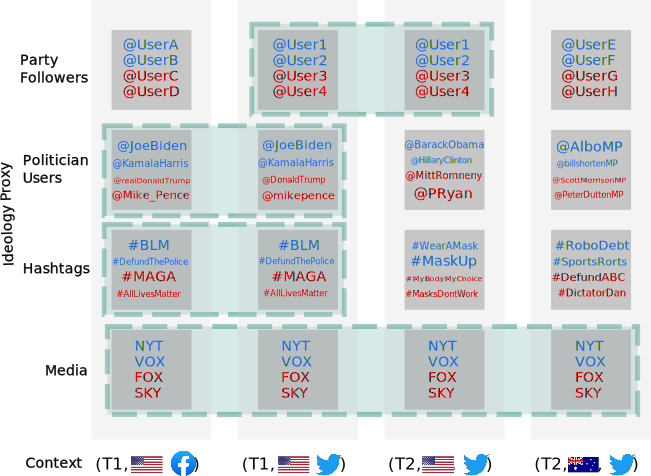
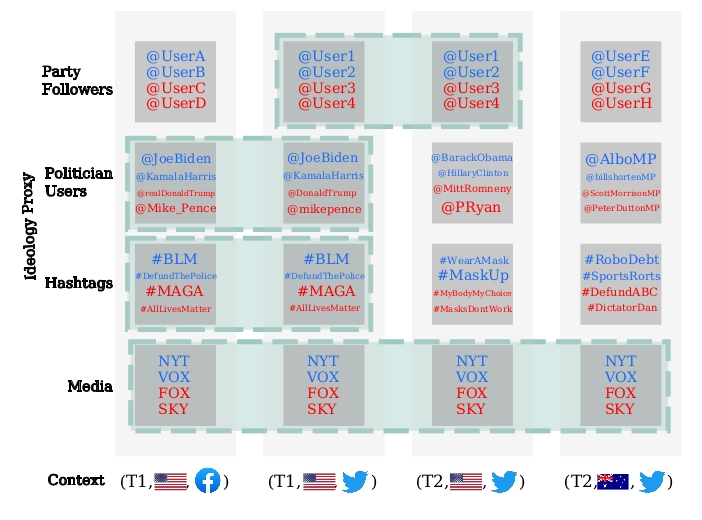
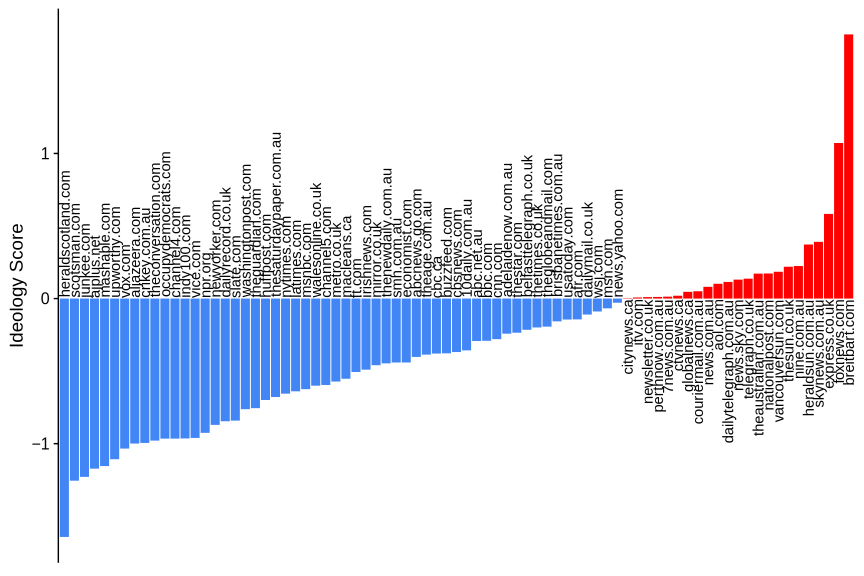
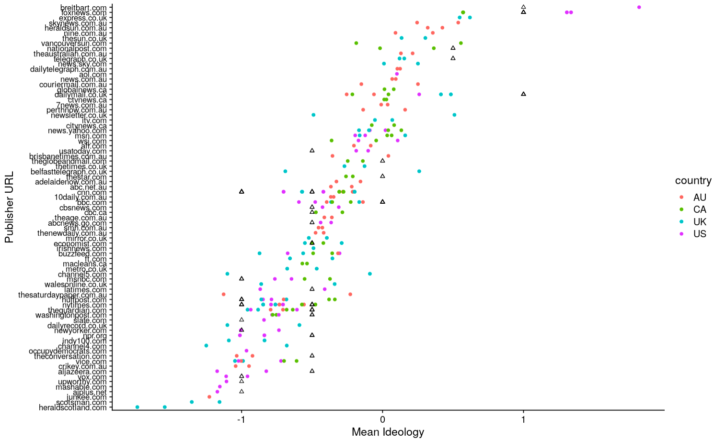
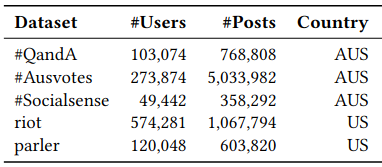

<iframe width="560" height="315" src="https://www.youtube.com/embed/csWMgU7R52Q" title="YouTube video player" frameborder="0" allow="accelerometer; autoplay; clipboard-write; encrypted-media; gyroscope; picture-in-picture; web-share" allowfullscreen></iframe>

Also check out [Rohit](../authors/rohit-ram/)'s and [Andrei](../authors/ma-rizoiu/)'s article that just appeared in The Conversation: [Can ideology-detecting algorithms catch online extremism before it takes hold?](https://theconversation.com/can-ideology-detecting-algorithms-catch-online-extremism-before-it-takes-hold-200629)

In this [our latest working paper](https://arxiv.org/pdf/2208.04097.pdf), we propose a completely automatic end-to-end ideology detection pipeline for the detection and psychosocial profiling of left-right political ideology, as well as far-right ideological users. 
The pipeline fills a crucial gap by providing flexible methodology and tooling for understanding ideologies and building early warning systems for extreme ideology-motivated (and potentially violent) activity.

**Paper citation:**
```
Ram, R. and Rizoiu, M.A., 2022. You are what you browse: A robust framework for uncovering political ideology.
arXiv preprint arXiv:2208.04097.
```
(_see full paper here: [https://arxiv.org/pdf/2208.04097.pdf](https://arxiv.org/pdf/2208.04097.pdf)_)

## Ideology in an Online World

Ideology determines how we make sense of much of the world, our opinions, and our political actions. 
It is not a new concept; throughout history, it served as the context for unrest. 
However, ideological spread and radicalization have entered a new paradigm in our ever-connected world. The internet is a significant source of information and spreads opinions quickly through social platforms.
In particular, the anonymity and lack of accountability often associated with online communication set up a supportive environment for spreading far-right ideologies and radicalizing individuals into extremist groups.
Far-right extremism is a form of ideology that advocates for ultranationalism, racism, and opposition to immigration and multiculturalism. 
These ideologies strongly correlate with violence and terrorism and threaten individual and collective security.

The Australian Security Intelligence Organisation (ASIO) raised concerns about Australians being radicalized very young and the rise of extremist movements in Australia through online technologies [@asio]. 
ASIO claimed that during the COVID period, 30-40% of their caseload was devoted to far-right extremism, up from 10-15% in 2016 [@guardian1]. 

Unfortunately, Ideologically Motivated Violent Extremism (IMVE) continues to be an issue in Australia. 
On December 12th, 2022, two Queensland police officers were killed while performing routine duties [@guardian2]. 
Later investigations would uncover that the three people, who killed the officers, were active online in producing deep-state and religious conspiratorial content. 
Their content has since been removed from mainstream social platforms but continues to be shared on conspiratorial websites.
Such extreme-leaning content often serves as a lead indicator of violent extremism (as was the case in this incident and the Christchurch Mosque Shootings three years prior). However, the tools to identify and understand the psychosocial characteristics of these extreme individuals and communities are lacking.

In this work, we build an end-to-end ideology detection pipeline and psychosocial profiles of ideological groups. 
We find that right-leaning individuals tend to use moral-vice language more than left-leaning and that far-right individuals' grievance language (violence, hate, paranoia, etc.) significantly differs from the moderates.

## Signals of Ideology

In online social settings, researchers face numerous barriers that prevent using traditional methods.
Directly asking users for their ideologies has dubious success, infringes on platform T&Cs, and does not scale to online populations. 
Inferring users' ideologies from their activity also does not scale as the data requires is prohibitively expensive and tedious to compile.

Instead, to reduce expert labor to feasible levels, researchers infer ideologies from signals in user behavior -- such as whether they use political hashtags, retweet politicians, or follow political parties.
We dub these signals _ideological proxies_.

Importantly, these _ideological proxies_ for online users can still require laborious labeling by context-specific experts.
For example, the hashtag _#ScottyFromMarketing_ requires an up-to-date expert in Australian politics to uncover that it expresses an anti-right-wing ideology. 
For many researchers:
- access to contextual experts is difficult,
- labeling of signals is still laborious and expensive,
- and context switches require relabelling (exasperating the above problems).

Unfortunately, such context switches are commonplace, as the context changes with time, country, or social platform. 
Figure \@ref(fig:teaser) showcases the problem: most commonly used _ideological proxies_ can only be transferred in narrow circumstances (represented by the green dotted regions).
For example, following political parties is country-dependent, politicians come and go with time, and hashtags are platform-dependent.
As such, we desire an _ideological proxy_ that is robust to changes in context, requires no expert labeling and is true to the gold standard.

```{r teaser, echo = FALSE, fig.cap = 'Schema showing that not all ideological proxies can context-switch.', out.width = "700px"}

```
<!--  -->

Furthermore, the _ideological proxies_ are often sparse among users; however, we would ideally like to detect influence amongst the entire population of users (as taking only active users could bias our inferences).
We further desire a method for inferring the ideology of (potentially inactive) users without direct _ideological proxy_ information.

## Our Solution: You are what you browse

Our solution is a large-scale end-to-end ideology detection pipeline that can be used to profile entire populations of users. 
The solution has two main components; the media proxy and the inference architecture. 
The media proxy allows for labeling a subset of users, and the inference architecture allows for propagating these labels to the remaining users via socially-informed homophilic lenses. 

### The Media Proxy
For the first part of our work, we generate a proxy based on media-sharing behavior, which satisfies the desiderata. 

We generate the media proxy via two media slant datasets (although many are widely available). 
The first is an extensive survey of media consumption behaviors conducted by Reuters [@newman2019reuters] in several countries in 2020 and 2021.
Participants reported the media publications they consume and their own political ideology. 
We estimate the slant of a media source for each country and year as the average ideology of the participants who consume it. 
The second dataset is the Allsides Media Bias Dataset [@sides2018media], which contains an expert-curated set of media publications. 
The Allsides dataset contains mostly American-based media; conversely, Reuters covers the major media outlets in each country. 
Given that each country and period will have a different conception of ideologies, we calibrate Reuter's media slants to approximate the Allsides (minimizing the mean-squared error). Figure \@ref(fig:slants) shows the slants for each media website within the Reuters dataset.

```{r slants, echo = FALSE, fig.cap = 'Plot showing the slants for various media websites.', out.width = "700px"}

```
<!--  -->

<!-- We finally define the media slant of a media website, as its average over the country, year, and sources, and  -->
Finally, we quantify a user's ideology as the average ideology of their shared media.

The media proxy resolves the issue of context switching; since it is applicable across many contexts and can be used widely in a fully automated fashion. 
This allows us to create an end-to-end ideology detection pipeline.

We further define methods to classify far-right users from their media-sharing behaviors, which we fully describe in the paper.

### The Inference Architecture
In the second part of our work, we define an inference architecture that allows inferring the ideological labels of the remaining users -- e.g., users who do not share any URLs.
Our inference architecture relies on the sociological principle of homophily, where we hypothesize that similar users will share a similar ideology. 
We measure homophily through three distinct lenses; 

  1. *Lexical*: Users with similar language will have similar ideology
  2. *Hashtag*: Users who participate in similar topics of discussion share a similar ideology
  3. *Resharing*: Users who consume similar content (signaled via resharing of other users) will share a similar ideology

Through these lenses, we utilize an AutoML model, FLAML [@wang2021flaml] (with the LightGBM architecture), trained on users identified via an ideological proxy to propagate the labels to the remaining users and generate a complete ideological profile for a dataset.

## The Data
We utilize several large-scale datasets from various platforms to showcase the relative ease of applying our end-to-end pipeline. 
The datasets' characteristics are described in Table \@ref(tab:datasets). 
<!-- For evaluation purposes, we use \#QandA based on the popular ABC panel show. -->

```{r datasets, echo = FALSE, fig.cap = 'The datasets used through-out the analysis.', out.width = "700px"}
library(data.table)
tab <- data.table(cbind(
  Dataset=c('#Qanda', '#Ausvotes', '#SocialSense', 'Riot', 'Parler'),
  Users=c('103,074', '273,874', '49,442', '574,281', '120,048'),
  Posts=c('768,808', '5,033,982', '358,292', '1,067,794', '603,820'),
  Country=c('AUS','AUS','AUS','US','US'))
           )
  knitr::kable(
    tab, booktabs = TRUE,
    caption = 'The datasets used through-out the analysis, with the number of users, posts, and affliated country.'
  )
```
<!--  -->

### Psychosocial profiles of the Ideological Groups
Large-scale profiling of entire online populations gives us significant insights into the characteristics of online populations. 
We apply our inferred ideological labels of online users in two critical ways:

1. We derive a method for distinguishing the left and the right in terms of their moral language.
2. We derive a method for distinguishing moderate and extreme ideologies in terms of their grievance language.

**Distinguishing Left and Right**: 
We utilize the FrameAxis [@mokhberian2020moral] methodology to metricize each user's association with each of the five Moral Foundations [@graham2013moral] in terms of their vice and virtue axes. 
Given the measures of the Moral Foundations in the user language, we can start to detect in what way the left and the right differ. 
To do this, we find each ideological group's mean vice and virtue scores and compare these to the neutral group. 
Figure \@ref(fig:mft) shows the outcome of this analysis on the SocialSense dataset.

```{r mft, echo = FALSE, fig.cap = 'Plot of the moral foundations of ideological groups in the SocialSense dataset, showing that the left prefer virtue and the right prefer vice language.', out.width = "700px"}
knitr::include_graphics('mft_diff_plot.svg')
```
<!--  -->

We see that the left prefers the language of virtue, while the right prefers the language of vice. 
This trend is largely consistent across all datasets.

**Distinguishing Moderates and Extremes**: We similarly generate measures via the Grievance Dictionary [@van2021grievance], a threat assessment tool designed to highlight potential threats through their language. 
Similar to the previous plot, we investigate the distribution of grievance scores for the ideological groups. 
However, here we measure the difference between distributions with the Signed KL-divergence (a measure of the difference in the location and shape of distributions). 
Figure \@ref(fig:grievance) shows the results for the Ausvotes dataset.

```{r grievance, echo = FALSE, fig.cap = 'Plot of the grievance categories of ideological groups in the #Ausvotes dataset, showing that the far-right is significantly different.', out.width = "700px"}

```
<!--  -->

We observe that the far-right's usage of grievance language is significantly different from the moderate ideological groups. 
This adds evidence to the growing concern that members of the far-right may vent their frustration and participate in violent behavior. 

## Conclusion
In this work, we build a fully automatic end-to-end ideology detection pipeline for left-right and far-right detection. 
Importantly, with the pipeline, we can show the differences between the left and right, and moderates and extremes in terms of psychosocial language, across a range of diverse datasets.

### References