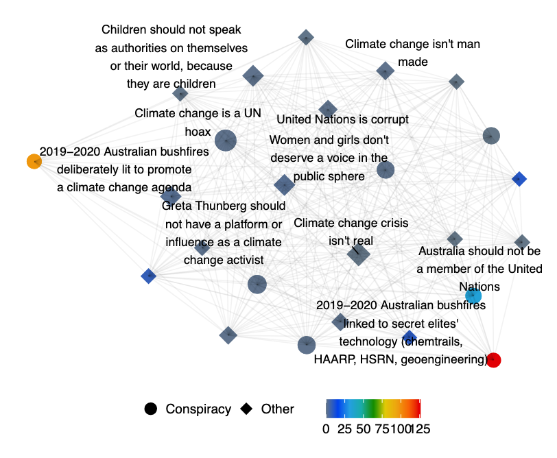

In our [recent paper](https://arxiv.org/pdf/2109.00302.pdf) accepted at [ICWSM 2022](https://www.icwsm.org/2022/index.html/), we propose a complete solution to accelerate the qualitative analysis of problematic online speech — with a specific focus on opinions emerging from online communities — by leveraging machine learning algorithms.

**Paper citation:**
```
Quyu Kong, Emily Booth, Francesco Bailo, Amelia Johns, and Marian-Andrei 
Rizoiu. Slipping to the Extreme: A Mixed-Method to Explain How Extreme 
Opinions Infiltrate Online Discussions. In: Proceedings of the 16TH AAAI 
International Conference on Web and Social Media, 2022.
```
(see full paper here: https://arxiv.org/pdf/2109.00302.pdf)

### Problematic Speech: A Modern Plague
Problematic speech is online interactions, speech, and artifacts that are inaccurate, misleading, inappropriately attributed, or altogether fabricated [1]. 
In 2020, the COVID-19 pandemic alerted the world to complex issues that arise from social media platforms circulating user-generated misinformation, hate speech, and conspiracy theories [2]. 
There are several primary types of quantitative methods for addressing problematic information, including large-scale monitoring of social media datasets [3], understanding platforms, users, and networks contributing to the "infodemic" [4], and predicting future pathways of information spreading [5].
These studies provide valuable insights into understanding how problematic information spreads and detecting which sources are reshared frequently and by which accounts. 
However, these approaches often have less to say about why certain opinions and views gain traction with vulnerable groups and online communities. 

Qualitative research methods are well placed to address this gap. 
They provide rich, contextual insights into online communities' social beliefs, values, and practices, which shape how information is shared and how opinions are formed [6].
Nevertheless, a common criticism of qualitative research is that the in-depth knowledge comes at the expense of generating insights of limited representativeness and weak robustness of the findings. 
Therefore, there is a gap between the depth of insight gained from ethnographic and qualitative approaches and the breadth of knowledge gained from computational methods from data science.

Our work fills this gap by proposing a mixed-method approach that combines qualitative insights, large-scale data collection, and human-in-the-loop machine learning approaches. 
We apply our method to map in-depth and in-breadth the problematic information around four topics: 
*2019-20 Australian bushfire season*,
*Climate change*,
*COVID-19*, and
*Vaccination*
on three social media platforms (Facebook, Twitter, and YouTube).

## Our Solution: Mixing Digital Ethnography with Advanced Machine Learning


We present a complete solution that bridges and facilitates qualitative and quantitative analysis to study problematic online speech. 
The pipeline consists of three components which are detailed in this section.

### Deep qualitative study
The first component is the qualitative study. 
We build a platform based on an open-source tool, [*Wikibase*](https://wikiba.se/), where we conduct qualitative and quantitative analysis.
Through the quantitative study, we build an ontology of problematic online speech.
We label a large number of social media postings using their topics.
Simultaneously, we construct a vocabulary of 71 opinions that we also use to label postings.
Some example opinions include:
  - Climate change crisis isn't real
  - United Nations is corrupt
  - Climate change is a UN hoax
  - United Nations wants to be the global ruling government
  - Vaccines cause Autism
  - The World Health Organisation is corrupt

These opinions contain mistrust in the government and supra-national structures (e.g., UN, WHO) and typical misinformation about vaccines.

### Unlabeled data collection
Qualitative approaches analyze emerging content and construct the vocabulary simultaneously when labeling the data.
However, they lack representativeness as they tend to be overly concentrated on narrow areas of the narrative landscape.
For this reason, the second step in our methodology involves collecting data at scale.
We collect large-scale raw data using the uncovered vocabulary from the deep qualitative study. 
We construct keywords (shown in the table) for each topic to crawl social media data from three platforms. 
We obtain a total of **13,321,813** postings — **11,437,009** Facebook postings, **1,793,927** tweets and **90,877** YouTube comments.


### Dataset augmentation
The next step is to annotate all the postings in our dataset automatically.
We employ machine learning algorithms to augment the data labeling process with a human-in-the-loop setting.

By adopting the state-of-the-art text classification algorithm, RoBERTa [7,8], we first train the classifiers to identify problematic speech on postings annotated by the qualitative researchers. 
Next, we deploy three strategies to select unlabeled data. 
The active learning [9] strategy selects the data for which the classifiers are most uncertain. 
The top-confidence strategy selects data that classifiers are most certain about. 
The third strategy — the random strategy — randomly samples from unlabeled data. 
The qualitative researchers then label the sampled data, introduce the newly labeled data in the ontology, and repeat the procedure iteratively until the predictive performance converges.

## Human-in-the-loop Performance
We discuss here the convergence of prediction performance over labeling iterations.

The following plot depicts the prediction performance on the test set macro-averaged over topics (accuracy in the left panel and F1 score on the right panel) over iterations.
The solid lines show the performance indicators, together with the cross-validation generalization error.

The cross-validation performance is stable across iterations. 
This is expected as the classifiers learn from the same data on which the generalization is estimated — i.e., the classifiers are representative of the data they were trained on.
However, the difference between the test set performance and cross-validation performance is indicative of the representativity over the entire dataset. 
The cross-validation accuracy is consistently lower than the test set accuracy because the test data is more imbalanced than labeled data. 
The cross-validation F1 is more optimistic than the test set F1. 
Finally, the difference between the two stabilizes for the later iterations, further suggesting the convergence.

## Applying the Qualitative Mapping

We employ the obtained augmented labeled set to analyze the dynamics of problematic opinions at scale. 
We machine-label the opinions in a large set of postings spanning over a long time, allowing us to apply the qualitative-defined coding schema to a significantly larger sample of postings.
This reduces the unavoidable selection bias of the deep qualitative study. 
It also offers a critical tool for analyzing co-occurring opinions, which helps identify central opinions. 
It is common for postings to express multiple opinions.

We explore central opinions by building an opinion co-occurrence network in the online conversation of the topic **2019-20 Australian bushfire season**. 
In the network, nodes are the opinions captured during the bushfire conversation, while edges are present when both opinions are detected in the same postings. 
The node degree of a given opinion node represents the number of opinions that co-occurred with it. 
The edges are weighted by the number of postings in which their connected node opinions co-occurred.

The following plot presents each edge's daily proportions of weights among all edges between September 2019 and January 2020. 
We show six edges (i.e., opinion pairs) to represent three types of temporal dynamics:
  - A continuous and relatively strong association between prevalent opinions — "Climate change crisis isn't real" and "Climate change is a UN hoax," which not notably is a conspiracy theory.
  - Associations with declining relative frequencies — "Greta Thunberg should not have a platform or influence as a climate..." and "Women and girls don't deserve a voice in the public sphere".
  - Rising associations such as "bushfires and climate change not related" and "bushfires were caused by random arsonists"; and also the conspiracy theory associations between "United Nations is corrupt" and "United Nations wants to be the global ruling government".


In the following plot, we map the co-occurrence network from posts published over 14 days in late September 2019, i.e., the period when the betweenness for conspiracy opinions is at peak. 
This figure explains the ambivalent network role that conspiracy opinions can play: we first note a conspiracy opinion with relatively high degree and frequency — "Climate change is a UN hoax" —, while we also observe the presence of low degree but high betweenness conspiracy opinions at the periphery of the network — "Bushfires linked to secret elites' secret technology (chemtrails, HAARP, HSRN, geoengineering)", "bushfires deliberately lit to promote a climate change agenda" and "Australia should not be a member of the United Nations".



## References
[1] Jack, C. 2017. Lexicon of lies: Terms for problematic information. Data & Society.  
[2] Posetti, J.; and Bontcheva, K. 2020. Disinfodemic: deciphering COVID-19 disinformation. Policy brief 1.  
[3] Ram, R.; Kong, Q.; and Rizoiu, M.-A. 2021. Birdspotter: A Tool for Analyzing and Labeling Twitter Users. In WSDM. ACM.  
[4] Smith, N.; and Graham, T. 2019. Mapping the anti-vaccination movement on Facebook. Information, Communication & Society.  
[5] Molina, M. D.; Sundar, S. S.; Le, T.; and Lee, D. 2019. “Fake news” is not simply false information: a concept explication and taxonomy of online content. American behavioral scientist   
[6] Glaeser, E. L.; and Sunstein, C. R. 2009. Extremism and social learning. Journal of Legal Analysis.  
[7] Vaswani, A.; Shazeer, N.; Parmar, N.; Uszkoreit, J.; Jones, L.; Gomez, A. N.; Kaiser, L.; and Polosukhin, I. 2017. Attention is all you need. In NeurIPS.  
[8] Liu, Y.; Ott, M.; Goyal, N.; Du, J.; Joshi, M.; Chen, D.; Levy, O.; Lewis, M.; Zettlemoyer, L.; and Stoyanov, V. 2019. Roberta: A robustly optimized BERT pretraining approach. arXiv.  
[9] Settles, B. 2012. Active learning. Synthesis lectures on artificial intelligence and machine learning.